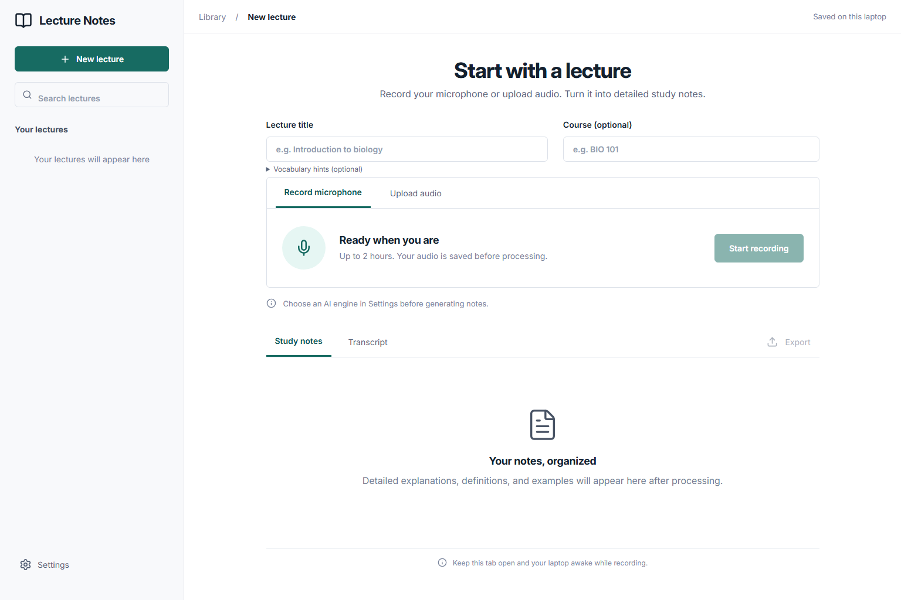

# Note Flow

A Windows laptop web app for microphone capture or audio uploads, timestamped transcripts, detailed study notes, editing, local history, and Markdown/text export. The application and its recordings stay in this folder. English is supported initially.



## Set up a new clone

Requires **Windows x64, Node.js 24+ and pnpm 11.19.0**. FFmpeg and FFprobe are restored with the app dependencies; the AI tools and models are separate downloads. The app runs on your laptop at http://127.0.0.1:3100.

```powershell
git clone https://github.com/ishaanp987/Note-Flow.git
cd Note-Flow
pnpm install --frozen-lockfile
pnpm run build
```

Then double-click **Start Lecture Notes.cmd**. Choose an engine in **Settings**: enter a Groq Free-plan key securely there, or follow [local AI setup](docs/LOCAL-AI-SETUP.md). A fresh clone has no API credentials or AI models configured. See [the user guide](docs/START-HERE.md) for recording, editing and export.

The repository contains the complete source, tests, approved specification, implementation plan, and verification evidence. Recordings, lecture databases, credentials, downloaded tools/models, dependencies and build output are excluded. Keep your recordings backed up separately.

## Launch on this laptop

After setup, double-click **Start Lecture Notes.cmd**. It starts the installed local AI service and production app in the background, then opens http://127.0.0.1:3100. No PowerShell execution-policy change is needed. Local AI was configured and downloaded on the original development laptop; those downloads are not included in a clone.

Record or upload audio, select **Local — on this laptop**, and choose **Transcribe & generate notes**. Review the transcript and timestamp references against the audio before relying on the notes. Optional vocabulary hints help with names and specialist terms.

Use **Stop & save** before closing a recording. Keep the tab open and laptop awake until saving finishes. Before shutting down the app, stop processing and wait for its interrupted status. Double-click **Stop Lecture Notes.cmd** to stop processes started by this launcher; it checks their executable and project command first. A browser tab closing alone does not stop the background app. Restarting the laptop also stops it. No startup task has been installed.

The launcher uses the Codex bundled Node 24 runtime, falling back to a Node 24+ installation on PATH. If this folder is moved, update the whisper executable/model paths in Settings.

## Free cloud setup

Open **Settings**. Use only a Groq account confirmed to be on its **Free plan**, with no billing enabled. Enter its key in the password field, check the Free-plan confirmation, save, and select Groq. Never paste the key into chat. The key stays in server memory and must be entered again after restart; it is not saved to disk or returned by the API. Audio and transcript text are sent to Groq only when you choose cloud processing.

Cloud uses `whisper-large-v3-turbo` and `openai/gpt-oss-20b` hosted by Groq. No OpenAI API, paid fallback, account upgrade, or billing setup is used. Account confirmation is supplied by you; this app cannot independently inspect your Groq billing plan. Cloud quotas can interrupt a lecture. Wait and resume or select Local. Completed audio chunks and generated section work are retained.

Groq's current [speech documentation](https://console.groq.com/docs/speech-to-text) lists a 25 MB Free-plan upload limit; the app normalizes ten-minute chunks to approximately 19.2 MB. Check [Free-plan rate limits](https://console.groq.com/docs/rate-limits) and your account's actual limits. These may change. A real cloud request has not been verified because no key was supplied.

## Local tools

Verified portable tools: whisper.cpp v1.9.2 (`tools/whisper/Release/whisper-cli.exe`), quantized `small.en` speech model (~181 MiB), Ollama v0.35.1 (`tools/ollama/ollama.exe`), and local `qwen3:4b` (~2.5 GB). See [local AI setup](docs/LOCAL-AI-SETUP.md) to restore them. Ollama is started on 127.0.0.1:11434 with `OLLAMA_NO_CLOUD=1` and its model storage in this project's `models/ollama`. Cloud model names are rejected by the app. These tools were downloaded from [whisper.cpp releases](https://github.com/ggml-org/whisper.cpp/releases), the [official model repository](https://huggingface.co/ggerganov/whisper.cpp), and [Ollama releases](https://github.com/ollama/ollama/releases).

Local processing speed depends on the hardware, model and lecture length, with no promised completion time. AI can omit or misinterpret content despite evidence review; check the sources.

## Storage and recovery

- `data/lectures.sqlite` stores lecture metadata, transcript/notes, edits, and processing state. Lecture folders in `data/` contain uploaded originals or saved recording chunks and normalized playback audio.
- Uploads stream to disk. Limit: two hours and 2 GiB; MP3, M4A, WAV, WebM. Allow disk space for the original, normalized copies, and approximately 230 MB of two-hour processing chunks, plus installed models/tools.
- Recording saves chunks about every five seconds. A crash may lose the last unsaved seconds. Reopen the lecture and choose **Recover saved recording chunks**. Recording playback is normalized to M4A; the source browser chunks remain saved.
- Processing failure keeps the original audio and completed sections. Resume is manual. A stopped job or server restart becomes interrupted, rather than complete. No demo transcript or notes replace a failed result.
- Saving transcript edits marks notes stale. Regeneration produces a separate draft; review and explicitly replace or discard it. Save or cancel edits before changing views.
- Export notes as Markdown and transcript as timestamped text. Download audio from its player. Permanent deletion requires the app's explicit confirmation and removes only that lecture's folder and record.
- For a backup, stop the app and copy the entire `data` folder, including the database. Exports contain only the exported document, not your recording.

## Development and verification

Dependencies are pinned in `pnpm-lock.yaml`. Use pnpm with Node 24+; `pnpm install --frozen-lockfile` restores them. Equivalent npm scripts run through `pnpm run`: `dev`, `build`, `start`, `typecheck`, `lint`, `test --run`, and `test:e2e`. The backend binds to localhost; `--host` is unnecessary. `pnpm run dev` serves port 3100. `pnpm run build` creates `dist/client`; `pnpm run start` serves the production build.

Use the documented Node.js and pnpm versions in your development environment.

To install and run browser tests in PowerShell:

```powershell
$env:PLAYWRIGHT_BROWSERS_PATH = Join-Path $PWD 'tools/playwright'
pnpm exec playwright install chromium
pnpm run test:e2e
```

The tests start an isolated app on port 3101 with storage in `work/e2e-data`. They use a synthetic microphone and a frozen, genuinely generated result for repeatable editor/export tests; these tests do not make AI calls or seed the personal library. `tests/fixtures/cells.wav` was synthesized by Windows from a known biology script. The real local-provider check was performed separately in the app.

See [verification evidence](docs/VERIFICATION.md) for passed checks and checks that still need a real microphone, cloud credentials, or a full spoken lecture. The approved requirements are in [SPEC.md](SPEC.md), with the plan and task status in [tasks/plan.md](tasks/plan.md) and [tasks/todo.md](tasks/todo.md).
